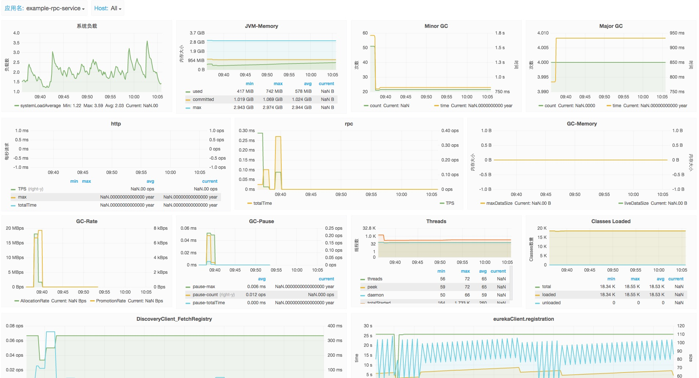
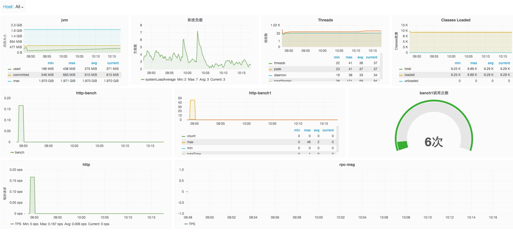

# 监控

Atlas+Spectator+Grafana搭建的实时监控大盘.

[搭建文档入口]()

## 功能点

* HTTP请求TPS监控, 维度可细分, 包括uri,method,status(http返回状态)
* HTTP请求每秒最大时间, 每秒累计总响应时间; 维度同上
* RPC服务端和客户端监控
* JVM内存使用情况
* GC情况, 包括Minor,Major GC的次数,执行时间,暂停时间,内存回收速率,存活对象大小等
* 系统负载情况
* 线程数量
* 类加载数量
* 自定义业务指标监控
* DiscoveryClient相关监控

## 接入方式
监控相关功能封装在kylin-monitor模块, 默认会由基础框架自动引入(kylin-starter模块), 无需额外显示引入.

## 快速体验

dev: http://192.168.30.142:3000
prod: http://monitor.59store.com

_(该服务均需59内网才可访问, 公司以外网络请使用vpn.)_

点开后自行注册, 注意请使用公司邮箱和花名.

目前在Grafana中提供两个Dashboard, 一个是通用Dashboard, 会自动收录已上报监控数据的服务和机器, 暂时通用监控面板内容; 另一个是应用监控模板, 各应用可以参考模板自定义各自的监控面板.





## 详细说明

### 名称解释:

* metricsName: 监控指标名称
* tag: 监控指标的标记, 每个metric可以有多个tags, 每个tag是一个key,value的键值对, 可用于分类,属性标识.
* Timer: 时间维度统计, 常用于统计事件发生速率, 每秒总时间等, 记录5种统计值，count, max, min, totalOfSquares, totalTime, 分别用于计算发生速率，单次最大时间，单词最小值, 类方差，每秒累计时间
* Gauge: 用于记录一些具体数值， 比如线程池中正在运行的线程数等。
* Counter: 用来统计事件发生的频率

### 监控指标信息查询

监控数据上报给Atlas, Atlas提供了强大的语法查询功能, 可查询监控指标详情, 监控json数据, 监控图表等. [官方文档入口](https://github.com/Netflix/atlas/wiki)

以下给出监控指标信息查询样例:

* 查询所有监控指标:
http://192.168.30.40:7101/api/v1/tags/name

* 查询名为"rest"的metric所有tags:
http://192.168.30.40:7101/api/v1/tags?q=name,rest,:eq

* 查询名为"rest"的metric的tag为statistic的可选值:
http://192.168.30.40:7101/api/v1/tags/statistic?q=name,rest,:eq

### Global Tags: 
* "app": 应用名 
* "ip": 机器IP

### HTTP请求

* name: rest, 指标名
* atlas.dstype: 数据类型, 可选值为:gauge
* exception: 已出异常名
* method: http请求方法, 如: GET, POST
* statistic: 统计类型, 可选值: ["count","max","min","totalOfSquares","totalTime"], 参考"Timer"解释.
* status: http响应状态码, 比如200, 301, 302, 400等
* type: 类型, ["COUNTER","GAUGE","NORMALIZED"]
* unit: 时间单位, ["MILLISECONDS"]
* uri: 请求路径, 不包括参数

### RPC请求

#### 公共:
* name: rpc
* rtype: {"client", "server"}
* atlas.dstype: {"gauge","rate"} (这里选择"gauge"用于时间维度统计, "rate"用于统计发生次数)
* statistic: 参考"Timer"解释.
* unit: 时间单位, ["MILLISECONDS"]

#### RPC-Client
* host: RPC调用的服务HOST地址
* uri: RPC调用的服务的路径

#### RPC-Server
* class: 远程服务提供类名
* hasException: 执行过程中是否出现异常
* method: 提供远程服务的方法名

### 自定义监控

代码中在方法上增加注解@Monitor(com.store59.kylin.monitor.annotation.Monitor)

注解参数:
* metricName: 监控指标命名, 默认为类名加方法名, 如"OrderService.createOrder"
* type: 统计类型, 默认为timer统计, types不为空时, 该属性失效. 可选枚举值为 {TIMER(时间维度统计, 包括每秒最大值, 频率, 每秒总耗时等), COUNTER(累计值统计, long), Gauge(数值统计, double)}
* types: 多个统计类型同时使用, 不为空时, type属性失效
* tags: 该指标其他维度的描述, 可用于分类

例如:


```
@Monitor(tags={
            @Tag(key="prop", value="v1"),
            @Tag(key="prop2", value="v2")
    },metricName="testService.bench")
public String bench() {
    return "hello bench";
}

@Monitor(tags={@Tag(key="key1", value="value1")}, types = {MonitorType.COUNTER, MonitorType.TIMER})
public String bench1() {
    return "hello bench1";
}

```

注意: metricName可不指定, 默认为类名加方法名

### 监控配置说明

* kylin.monitor.enabled: 控制是否开启监控, 包括metric统计和日志中的requestId, 默认开启
* kylin.monitor.atlas.enabled: 是否上报监控到atlas. 默认开启
* kylin.monitor.atlas.metric.filters: 配置被过滤不收集的监控指标信息
* kylin.monitor.rpc.server.enabled: 控制RPCServer是否开启监控, 默认开启
* kylin.monitor.rpc.statsd.enabled: 控制RPCServer是否开启statsd监控, 用于兼容之前监控, 默认开启, 另外受之前开关同时控制
* kylin.monitor.rpc.client.enabled: 控制RPCClient是否开启监控, 默认开启

